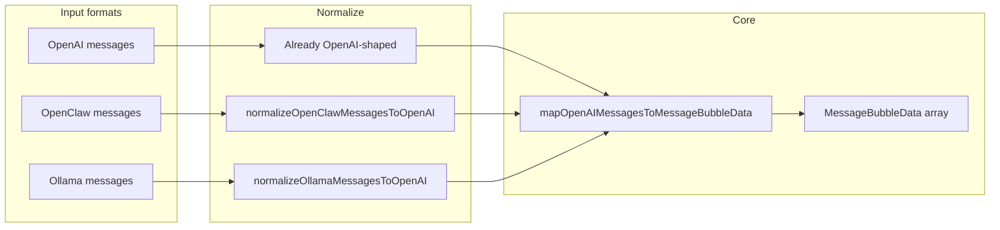

---
nav:
  title: R&D
  order: 6
group:
  title: Development
  order: 2
---

# Chat messages → BubbleList adapters {#chat-message-bubble-adapters}

> 中文：[多厂商聊天消息 → BubbleList 适配](./chat-message-bubble-adapters.md)

This guide explains how to turn `messages` from common **OpenAI**, **OpenClaw**, and **Ollama** requests/sessions into [`MessageBubbleData`](../../src/Types/message.ts) for [`BubbleList`](../../src/Bubble/List/index.tsx).

Implementation lives in [`src/Bubble/OpenAIMessageBubble/`](../../src/Bubble/OpenAIMessageBubble/index.ts). It does **not** depend on vendor npm SDKs; types are defined in-repo.

## Table of contents {#toc}

- [Design overview](#overview)
- [OpenAI Chat Completions](#openai)
- [OpenClaw session / transcript](#openclaw)
- [Ollama /api/chat](#ollama)
- [Streaming (SSE) and stable ids](#streaming)
- [API cheat sheet](#api-reference)
- [Example with BubbleList](#bubblelist-example)

## Design overview {#overview}

- **Goal**: produce `MessageBubbleData[]` for the `bubbleList` prop on `BubbleList`.
- **Two ways in**:
  - **Hooks**: recompute when React state changes (`useMemo` inside).
  - **Pure functions**: tests, non-React usage, or custom memoization.
- **Pipeline**: OpenClaw and Ollama messages are **normalized** to an OpenAI-compatible shape, then share the same OpenAI mapper to avoid duplicated logic.



## OpenAI Chat Completions {#openai}

Typical `chat.completions` `messages`: `role` + `content` (string or parts), optional `tool_calls`, `tool`, `function`, etc.

| Entry point | Role |
| --- | --- |
| `useOpenAIMessageBubbleData(messages, mapOptions?, mapMessage?)` | React hook |
| `mapOpenAIMessagesToMessageBubbleData(messages, mapOptions?, mapMessage?)` | Pure function |

**Default id**: `msg.id ?? \`openai-msg-${index}\`` (content is **not** hashed, to keep streaming stable).

**Notable `mapOptions`**: `baseTime` / `timeStepMs`, `getMessageId`, `toolRoleAs` ([`RoleType`](../../src/Types/common.ts) for `tool` / `function` rows), `appendToolCallsToContent`, `preserveRawInExtra` (`extra.openai.raw`), `bumpUpdateAtOnLastMessage`.

Embedded demo: “OpenAI messages - useOpenAIMessageBubbleData” under [Bubble](../components/bubble.md).

## OpenClaw session / transcript {#openclaw}

Extra fields on top of the OpenAI-like shape:

- **`timestamp`** (ms): optionally applied to `createAt` / `updateAt` (`useOpenClawTimestamps`, default on).
- **`toolResult`**: normalized to an OpenAI `tool` row; original role is available under `extra.openclaw.raw` (`preserveOpenClawRawInExtra`, default on).

| Entry point | Role |
| --- | --- |
| `useOpenClawMessageBubbleData` | Hook |
| `mapOpenClawMessagesToMessageBubbleData` | Pure function |
| `normalizeOpenClawMessage(s)ToOpenAI` | Structure-only conversion |

## Ollama /api/chat {#ollama}

Aligned with [Ollama Chat API](https://docs.ollama.com/api/chat) `ChatMessage`: `role` is `system` | `user` | `assistant` | `tool`, `content` is a string; optional **`images`** (base64 list), **`tool_calls`**, **`thinking`**, etc.

`thinking` and image-count hints are appended as readable placeholders (toggle with `appendThinkingToContent`, `appendImagesPlaceholder`). Default id: `msg.id ?? \`ollama-msg-${index}\``; originals under `extra.ollama.raw` (`preserveOllamaRawInExtra`, default on).

| Entry point | Role |
| --- | --- |
| `useOllamaMessageBubbleData` | Hook |
| `mapOllamaMessagesToMessageBubbleData` | Pure function |
| `normalizeOllamaMessage(s)ToOpenAI` | Structure-only conversion |

## Streaming (SSE) and stable ids {#streaming}

The adapters **do not parse SSE**; they only consume the `messages` array you keep in state. On each chunk, update state (for example grow the last `assistant` `content`).

Avoid using a **hash of `content`** as the message id, or keys will change every token and the list will remount. Prefer:

- A stable **`id`** assigned when the turn starts (server- or client-side), or  
- The default **index-based** id (index stays fixed while streaming that row).

## API cheat sheet {#api-reference}

Import from the package entry (also re-exported via `./Bubble`):

```ts
import {
  useOpenAIMessageBubbleData,
  mapOpenAIMessagesToMessageBubbleData,
  useOpenClawMessageBubbleData,
  mapOpenClawMessagesToMessageBubbleData,
  normalizeOpenClawMessagesToOpenAI,
  useOllamaMessageBubbleData,
  mapOllamaMessagesToMessageBubbleData,
  normalizeOllamaMessagesToOpenAI,
  type OpenAIChatMessage,
  type OpenClawChatMessage,
  type OllamaChatMessage,
} from '@ant-design/agentic-ui';
```

Per-message overrides: all three paths support `mapMessage` (signature `OpenAIMessagesMapMessage` on the OpenAI-shaped step); return an immutable update of `draft`.

## Example with BubbleList {#bubblelist-example}

```tsx
import {
  BubbleList,
  useOpenAIMessageBubbleData,
  type OpenAIChatMessage,
} from '@ant-design/agentic-ui';

const Demo = () => {
  const [messages, setMessages] = useState<OpenAIChatMessage[]>([]);
  const sessionAt = useRef(Date.now()).current;

  const bubbleList = useOpenAIMessageBubbleData(messages, {
    baseTime: sessionAt,
  });

  return (
    <BubbleList
      bubbleList={bubbleList}
      userMeta={{ title: 'User' }}
      assistantMeta={{ title: 'Assistant' }}
    />
  );
};
```

## Changelog {#changelog}

See **Bubble** in [changelog.en-US.md](./changelog.en-US.md) / [changelog.zh-CN.md](./changelog.zh-CN.md) for **v2.30.22** and later.
