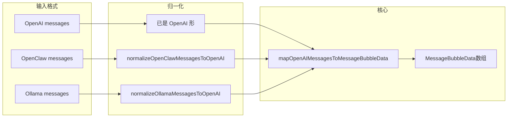

---
nav:
  title: 项目研发
  order: 6
group:
  title: 开发指南
  order: 2
---

# 多厂商聊天消息 → BubbleList 适配 {#chat-message-bubble-adapters}

> English: [Chat messages → BubbleList adapters](./chat-message-bubble-adapters.en-US.md)

本文说明如何将 **OpenAI**、**OpenClaw**、**Ollama** 等常见请求/会话中的 `messages` 转为库内 [`MessageBubbleData`](../../src/Types/message.ts)，并配合 [`BubbleList`](../../src/Bubble/List/index.tsx) 渲染。

实现代码位于 [`src/Bubble/OpenAIMessageBubble/`](../../src/Bubble/OpenAIMessageBubble/index.ts)，**不依赖**各厂商官方 npm SDK，类型均为库内自建 interface。

## 目录 {#toc}

- [设计概览](#overview)
- [OpenAI Chat Completions](#openai)
- [OpenClaw 会话 / transcript](#openclaw)
- [Ollama /api/chat](#ollama)
- [流式（SSE）与稳定 id](#streaming)
- [API 速查](#api-reference)
- [与 BubbleList 组合示例](#bubblelist-example)

## 设计概览 {#overview}

- **统一目标**：得到 `MessageBubbleData[]`，作为 `BubbleList` 的 `bubbleList`。
- **两条路径**：
  - **Hook**：在 React 组件内随 state 更新自动重算（`useMemo`）。
  - **纯函数**：测试、非 React、或自行控制 memo。
- **内部策略**：OpenClaw / Ollama 先 **归一化** 为与 OpenAI 兼容的结构，再复用同一套 OpenAI 映射，减少分叉逻辑。



## OpenAI Chat Completions {#openai}

对应 `chat.completions` 常见的 `messages`：`role` + `content`（字符串或多段），可含 `tool_calls`、`tool`、`function` 等。

| 入口 | 说明 |
| --- | --- |
| `useOpenAIMessageBubbleData(messages, mapOptions?, mapMessage?)` | React Hook |
| `mapOpenAIMessagesToMessageBubbleData(messages, mapOptions?, mapMessage?)` | 纯函数 |

**默认 id**：`msg.id ?? \`openai-msg-${index}\``（**不**用 content 做 hash，避免流式抖动）。

**`mapOptions` 要点**：`baseTime` / `timeStepMs`、`getMessageId`、`toolRoleAs`（`tool`/`function` 映射到的 [`RoleType`](../../src/Types/common.ts)）、`appendToolCallsToContent`、`preserveRawInExtra`（`extra.openai.raw`）、`bumpUpdateAtOnLastMessage`。

文档内嵌 demo：「OpenAI messages - useOpenAIMessageBubbleData」（见 [Bubble 文档](../components/bubble.md)）。

## OpenClaw 会话 / transcript {#openclaw}

在 OpenAI 形状基础上，常见额外字段：

- **`timestamp`**（毫秒）：可选写入 `createAt` / `updateAt`（`useOpenClawTimestamps`，默认开启）。
- **`toolResult`**：归一为 OpenAI 的 `tool` 行；原始角色可在 `extra.openclaw.raw` 查看（`preserveOpenClawRawInExtra`，默认开启）。

| 入口 | 说明 |
| --- | --- |
| `useOpenClawMessageBubbleData` | Hook |
| `mapOpenClawMessagesToMessageBubbleData` | 纯函数 |
| `normalizeOpenClawMessage(s)ToOpenAI` | 仅结构转换 |

## Ollama /api/chat {#ollama}

对齐 [Ollama Chat API](https://docs.ollama.com/api/chat) 的 `ChatMessage`：`role` 为 `system` | `user` | `assistant` | `tool`，`content` 为字符串；可选 **`images`**（base64 列表）、**`tool_calls`**、**`thinking`** 等。

映射时会将 `thinking`、图片数量等以可读占位拼入正文（可通过 `appendThinkingToContent`、`appendImagesPlaceholder` 关闭）；默认 id：`msg.id ?? \`ollama-msg-${index}\``；原始消息可在 `extra.ollama.raw`（`preserveOllamaRawInExtra`，默认开启）。

| 入口 | 说明 |
| --- | --- |
| `useOllamaMessageBubbleData` | Hook |
| `mapOllamaMessagesToMessageBubbleData` | 纯函数 |
| `normalizeOllamaMessage(s)ToOpenAI` | 仅结构转换 |

## 流式（SSE）与稳定 id {#streaming}

适配层 **不解析 SSE**，只消费你已维护好的 `messages` 数组。流式时在回调里更新 state（例如最后一条 `assistant` 的 `content` 不断增长）即可。

请避免用 **content 的 hash** 作为消息 id，否则每次增量都会变 key、列表会剧烈重挂载。优先使用：

- 服务端或客户端在**本轮开始时**为消息分配的 **`id`**，或  
- 默认的 **按索引** id（同一索引在流式过程中不变）。

## API 速查 {#api-reference}

从包入口可导入（亦可通过 `./Bubble` 再导出）：

```ts
import {
  useOpenAIMessageBubbleData,
  mapOpenAIMessagesToMessageBubbleData,
  useOpenClawMessageBubbleData,
  mapOpenClawMessagesToMessageBubbleData,
  normalizeOpenClawMessagesToOpenAI,
  useOllamaMessageBubbleData,
  mapOllamaMessagesToMessageBubbleData,
  normalizeOllamaMessagesToOpenAI,
  type OpenAIChatMessage,
  type OpenClawChatMessage,
  type OllamaChatMessage,
} from '@ant-design/agentic-ui';
```

单条自定义：三种格式均支持 `mapMessage`（OpenAI 路径下签名：`OpenAIMessagesMapMessage`），在默认 `draft` 上做不可变覆盖即可。

## 与 BubbleList 组合示例 {#bubblelist-example}

```tsx
import {
  BubbleList,
  useOpenAIMessageBubbleData,
  type OpenAIChatMessage,
} from '@ant-design/agentic-ui';

const Demo = () => {
  const [messages, setMessages] = useState<OpenAIChatMessage[]>([]);
  const sessionAt = useRef(Date.now()).current;

  const bubbleList = useOpenAIMessageBubbleData(messages, {
    baseTime: sessionAt,
  });

  return (
    <BubbleList
      bubbleList={bubbleList}
      userMeta={{ title: '用户' }}
      assistantMeta={{ title: '助手' }}
    />
  );
};
```

## 变更记录 {#changelog}

详见 [changelog.zh-CN.md](./changelog.zh-CN.md) / [changelog.en-US.md](./changelog.en-US.md) 中 **v2.30.22** 及后续版本 **Bubble** 小节。
